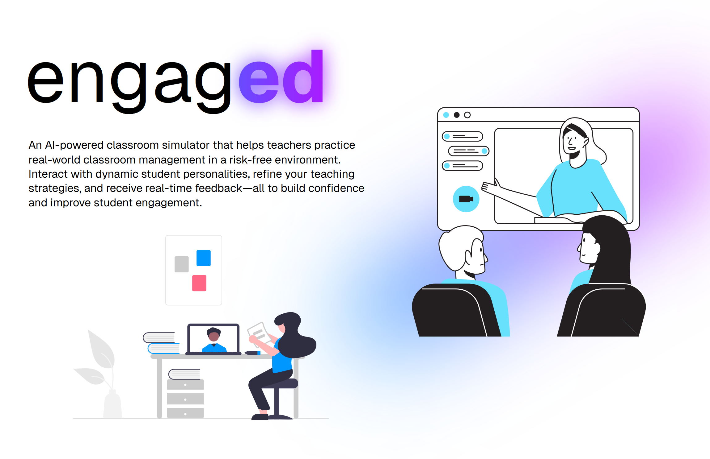
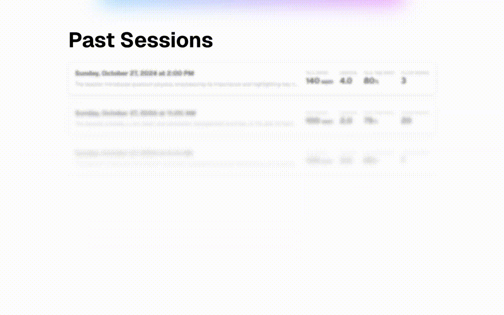

# _engagED_ - AI-Powered Classroom Simulation for Smarter Teacher Training 👩‍🎓👩🏾‍🎓👨🏻‍🎓

🌲 Made for TreeHacks 2025. [Devpost](https://devpost.com/software/teacher-teacher) · [GitHub](https://github.com/jasmine-dragons/treehacks-2025/)

## Inspiration

Every day, teachers step into classrooms filled with students who have different personalities, learning styles, and challenges. Some students are eager to participate, others are easily distracted, and a few might resist authority altogether. A teacher's ability to navigate these interactions can mean the difference between an engaging classroom and a chaotic one.

Yet, there are few opportunities for educators to practice classroom management in a realistic, risk-free setting. So, we asked ourselves: What if teachers could train for the classroom the way pilots train in flight simulators? Could we create an AI-powered environment where educators could interact with dynamic student personalities, receive real-time feedback, and refine their teaching techniques so that they can accel in the classroom?

That’s how we built _engagED_—an interactive classroom simulation that prepares educators for real-world teaching challenges. By leveraging AI-bots that simulate student behaviors and a performance analytics dashboard, _engagED_ helps teachers develop strong communication skills, manage classroom dynamics, and build confidence—all in a safe, controlled environment.

We believe that if _engagED_ is implemented in teacher training programs and professional development workshops, it could revolutionize how educators prepare for the modern classroom—leading to more engaged students, less burnout, and stronger learning outcomes across the board.

## What it does

_engagED_ simulates a classroom environment where teachers interact with AI-powered student personalities, each with unique behaviors, engagement levels, and challenges. The platform allows educators to practice managing real-world classroom dynamics—whether it’s handling a disruptive student, encouraging a quiet learner to participate, or maintaining engagement during a lesson.

_engagED_ responds to natural teacher interactions in a virtual classroom setting, adjusting student behaviors based on teaching strategies. Just like in a real class, students may ask unexpected questions, lose focus, or react differently depending on the teacher’s approach. At the end of each session, _engagED_ provides a performance dashboard, offering insights into key performance metrics and providing feedback for improvement.

## How we built it
_engagED_ was built by a mix of haxers from various backgrounds in frontend and backend roles. We began by wireframing and designing our user workflows, and then iterated upon these designs to create a seamless experience. We used a variety of cutting-edge technologies in this platform, which are outlined below. 

### Design and Wireframing


### Engineering


_Our tech flow_

The frontend was build in [React](https://react.dev/) and [Typescript](https://www.typescriptlang.org/) using [Next.js](https://nextjs.org/) as our frontend framework in order to maintain a structured codebase and fast loading times. The backend server was built in [Python](https://www.python.org/) and [FastAPI](https://fastapi.tiangolo.com/), allowing us to utilize a variety APIs such as [ElevenLabs](https://elevenlabs.io/), [OpenAI](https://openai.com/), [Groq](https://groq.com/), and [LangChain](https://www.langchain.com/). A websocket connection was also utilized between the frontend and backend in order to constantly stream audio data to the agents and LLMs, allowing for low latency. The database was created in [MongoDB](https://www.mongodb.com/) in order to store user sessions in a structured manner. 


_Client logic flow_

Diving deeper into our client logic, there are a lot of moving parts that bring _engagED_ together! We begin with the **teacher** user instructing the virtual class, and the **AI students** listening in. We then utilize OpenAI's [Whisper API](https://platform.openai.com/docs/guides/speech-to-text) in concurrence with Groq in order to convert this instruction to a text transcript. We then feed this transcript back into the AI Agents in order to provide them context and prompt them to chime in if neccesary. Each agent was build with [LangChain Agents](https://python.langchain.com/v0.1/docs/modules/agents/) and Groq to be able to respond to conversation with low latency. Initially, we ran each agent in parallel, but soon realized that this would cause them to talk over one another as they responded to the teacher. Thus, we implemented a round-robin algorithm between each agent and the teacher in order to minimize conflicts. 

Then, we utilize ElvenLabs' [text to speech API](https://elevenlabs.io/docs/api-reference/text-to-speech/convert) in order to convert the agent's conversational input into speech, and played this in the virtual classroom setting. The speech from the teacher is now combined with the latest transcripts and messages from the AI Agents to create a master transcript. This is now used as the context provided to the AI Agents for them to respond to the teacher. 

Once the session is ended, the master transcript is sent to OpenAI to summarize and provide analytics data for teachers. This is then displayed to the teachers in the following page. The data is then stored with their unique session id in MongoDB for retrieval and visibility later.


_Our tech stack__


## Challenges we ran into

Zoom API Issues: We attempted to use the Zoom API to programmatically start meetings with Zoom bots. However, after numerous attempts and insights from Zoom mentors, we realized that the Meeting Bot approach was not viable due to API limitations and planned deprecation. We ended up building our own solution for streaming web and audio to the backend and adding having agents receive this context.

Low-latency Interaction: We had to optimize AI interactions to maintain near-real-time responsiveness, ensuring that the virtual classroom felt immersive and natural. We attempted to achieve low-inference at every step possible using the Groq API to speed up Speech-To-Text and Agentic LLM reasoning. We found ElevenLabs API to be quite fast for Text-to-Speech.

Agent Coordination: AI student agents needed to understand each other's context and avoid talking over one another. Synchronization and maintaining conversational order proved to be a complex challenge. We used a mixture probabilistic activations for each agent, a cooldown period specific to each agent, and locks to ensure a clean virtual classroom experience.

Analytics APIs: We wanted to utilize a dedicated API in order to give users analytics on their sessions, but had a hard time finding options that were either sufficiently documented or free to use for this task. As such, we decided to utilize OpenAI's capabilities in order to analyze our transcripts. 

## Accomplishments that we're proud of
Overall, we were able to accomplish a lot and implement a lot of features for users: 
- multiple AI agents
- Analytics for users
- AI speech generation and personalities
- 

## What we learned

## What's next for _engagED_
There are many aspects of _engagED_ that we could improve:
1) Using a real-world dataset of teacher-student interactions to fine-tune the LLM model would be beneficial to getting more realistic practice for teachers.
2) Leveraging video analytics to understand expressions and hand-movements of the teacher would be useful for giving them more insightful feedback.
3) Implementing visual-language models to understand content that is shared via "screenshare" could help provide useful context for the LLM when it is generating feedback.
4) Creating a feature for teachers to customize the student persona.
5) Having more agents in the meeting & figuring out how to better implement student-student interactions as well to best simulate the classroom enviorment.
---

### Setup





## Development

For the backend:

1. Setup `.env`.

1. Install dependencies.

   ```sh
   $ cd backend/
   $ pip install -r requirements.txt
   ```

1. Then start the backend server:

   ```sh
   $ uvicorn main:app --reload
   ```

For the frontend:

1. Install dependencies.

   ```sh
   $ cd client/
   $ npm install
   ```

1. Start the Next.js development server:

   ```sh
   $ npm run dev
   ```
