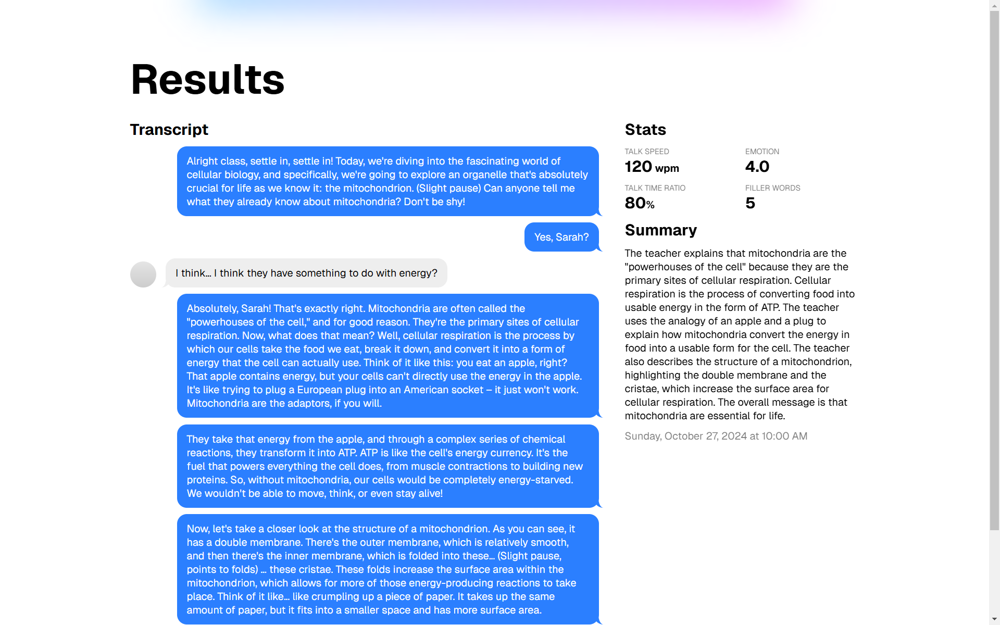
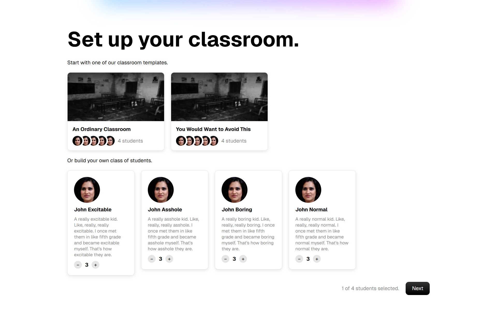
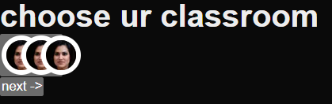

# 🌲 TreeHacks 2025: Teacher Teacher - AI-Powered Classroom Simulation for Smarter Teacher Training

## Inspiration
One of the biggest issues in education today is poor communication between teachers and students. The effects of this include poor perfomance for students and feelings of being burntout for teachers. We wanted to build something to address this. 

## What it does


## How we built it

## Challenges we ran into

## Accomplishments that we're proud of

## What we learned

## What's next for Teacher Teacher

_Training Teachers to Teach using AI._







Idea: Simulated environment for teachers to pilot lesson plans / teach different types of students

User flow:

On main dashboard:

1. Specify size of class

1. Specify personality / behavior of students (unengaged, disruptive, not understanding content, etc…)

1. Open up Sim environment

   - Say a zoom meeting with canvas and/or uploaded teacher slides

   - Teacher starts presenting, AI students act on their own and interact with teacher

     - Teacher has to adjust on the fly and figure out how to handle groups of students

   Cap total Video to like 5 minutes

1. On dashboard give feedback on how teacher handled students, how engaging presentation was, etc…can use perplexity

Tech Stack:

- Next.js/React.js Frontend -> Dashboard + Class Session Form
- CrewAI/Langraph Agents -> AI Students
- Deepgram/Google Cloud -> Speech to Text
- ElevenLabs/Cartesia -> Text to Speech
- Groq -> Fast LLM Inference (for AI Agents)
- Evaluation System
  - Transcript of meeting/script -> feed into OpenAI or Perplexity and get qualitative feedback
  - Voice Performance APIs -> get quantitative metrics (https://www.voicebase.com/developer-api-for-speech-analytics/)

## Development

For the backend:

1. Setup `.env`.

1. Install dependencies.

   ```sh
   $ cd backend/
   $ pip install -r requirements.txt
   ```

1. Then start the backend server:

   ```sh
   $ uvicorn main:app --reload
   ```

For the frontend:

1. Install dependencies.

   ```sh
   $ cd client/
   $ npm install
   ```

1. Start the Next.js development server:

   ```sh
   $ npm run dev
   ```
